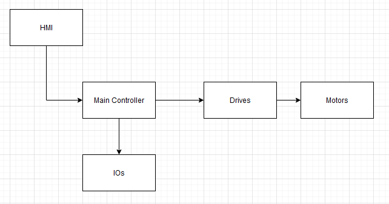

# Chapter 1 - Industrial Robots

"Learning how to control the position, orientation, speed, and force of the TCP is the ultimate goal of this entire book."

- `robot arm` == `manipulator`
- `links`
  - mechanical structure of arm
- `joints`
  - where links connect, typically actuated by motors
- `kinematics`
  - describe the position of linked objects in space
- `dynamics`
  - describe movement of objects under action of forces
- kinematics chain
  - `serial kinematics`
    - open chain of links (like a human arm, shoulder, elbow, wrist, fingers)
  - `parallel kinematics`
    - links positioned in parallel, like a group of legs or a tripod
- `mounting point (MP)`
  - where tool is mounted to perform task (gripper, drill, weld gun)
- `tool center point (TCP)`
  - tip at end of tool that actually interacts with the environment
  - note "tool" and "end effector" are interchangeable
  - tcp is conceptual
- `workspace`
  - range of all possible positions in space the TCP can reach
  - serial kinematics typically offer larger workspaces than parallel
- `collision detection`
  - aka workspace monitoring
- `pose`
  - combination of position and orientation of a target point
- `degrees of freedoms (DoFs)`
  - number of DoFs represents ability to position and orient the TCP along and around different axes
  - 6dof is:
    - (x, y, z) positions "along" axes
    - (greek, greek, greek) orientations "around" axes

## Comments

- kinematics model is most common approach for controlling a robot in industry
  - here, use `position-based commands`
  - in some cases, need force-based commands
    - screw tightening
    - bottle capping

## Structure of a Robot Control System

- HMI
  - for human to:
    - access the robot
    - make it move
    - check status
    - change config parameters
  - note: MUST be easy to use, the operator is not a programmer
- Main Controller
  - Reads information from user input, external sensors, motor encoders, cameras, etc
  - Internally processes that info based on rules and algorithms
  - Generates output signals to control actuators: motors, pumps, lights
- IOs
  - often synched with internal motion calculations
  - communication and coordination with other robots or machines
  - monitoring of safety areas
  - control of application-specific tools (welding gun)
  - feedback from sensor or camera
  - warning lights, sirens
- Drives
  - sends tommands to drives to tell them how and where to position
  - in industrial robots, these are typically separate, and the main controller sends info via `fieldbuses`

The controller is CPU, MCU, FPGA

## Digital Twin

Different simulation options:

- basic kinematic modeling
- advanced workspace monitoring
