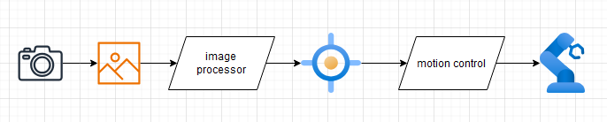

# Chapter 13 - Machine Vision

Gives robots more flexibility and awareness of its surroundings, with significant improvements in output quality, productivity, and safety

- visual servoing
  - driving a robot according to the input of an imaging device
  - accepts current pose of object in image and drives to target pose

Example tasks:

- Identification
  - put a label on an object
- Positioning
  - vision software automatically detects position and orientation of workpiece and allows the robot to align with it
- Tracking
  - like positioning but with moving workpiece
- Measurement
  - aka gauging
  - replaces manual measurements to assess the size of an object, for sorting or inspection
- Quality control

## Smart Camera

Oh shit, camera doesnt need to be mounted on arm. Can be globally mounted and calibrated

dont be afraid to preprocess the crap out of images to highlight differences

lenses also need to be scaled, but not always linear. need to evaluate:

- scaling [mm/px]
  - the linear size of each pixel. In case the scale factor is not uniform across the image, then a stretch matrix also needs to be calculated
  - like fisheye vs normal
- reflection [+-X or +-Y]
  - in case the camera flips one or both coordinate directions
- translation [delta X, delta Y]
  - the distance between the origins of the two coordinate systems
- rotation [alpha = atan2(delta Y, delta x)]
  - the relative orientation between two coordinate systems

## Vision Functions

Goal is to extract features

- Edge and corner detection
  - to simplify the image content while preserving its main structural features
- Contour finding
  - by analyzing the edges and segmenting the image
- Blob detection
  - to isolate individual regions of similar color or brightness
- OCR
  - to detect and decode text and numbers
- barcode detection and decoding
  - for product identification purposes
- object localization
  - to find the position, orientation, and size of a specific object by feature matching
- object detection
  - to distinguish between different classes of objects
